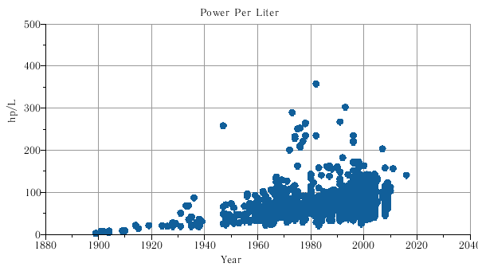
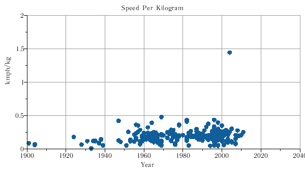
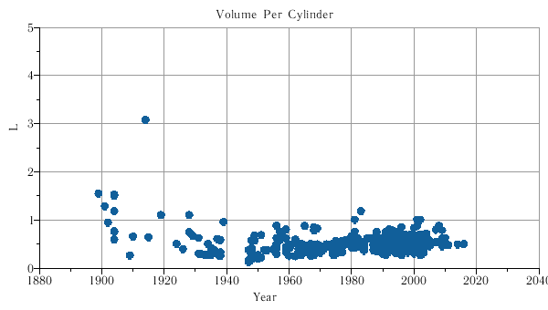

# Carfacts

Quick and dirty database of car facts parsed from various old sources.
The data is not 100% correct, but it's good enough for interesting stats and further refinement.

Technically the base is a list of "facts" in the form (car, parameter, value).
Multiple sources will often list slightly different values, as can be seen in this example:

```
$ ./cars specs veyron
```

**1999 Bugatti EB 16.4 Veyron**

| param               | value                                    |
| ------------------- | ---------------------------------------- |
| Price               | 500000 USD @ 1999, 1160000 EUR           |
| Volume              | 7993 cc, 7993 cc                         |
| Cylinders           | W16, 16                                  |
| Compressor          | 4 turbo                                  |
| Power               | 1001 hp @ 6200 rpm, 1001 hp @ 6000 rpm   |
| Torque              | 1250 nm @ 6000 rpm, 1250 nm              |
| Fuel feed           | direct injection                         |
| Valves per cylinder | 4                                        |
| Speed               | 406 kmph, 407 kmph                       |
| 0-100 kmph          | 2.9 s, 2.5 s                             |
| 0-200 kmph          | 7.3 s                                    |
| 0-300 kmph          | 14.0 s, 16.7 s                           |
| Fuel consumption    | 14.7 L/100km, 24.1 L/100km, 40.4 L/100km |
| Weight              | 1550 kg, 1600 kg, 1888 kg                |
| Body                | coupe                                    |
| Length              | 4466 mm, 4462 mm                         |
| Width               | 1998 mm, 1998 mm                         |
| Height              | 1206 mm, 1159 mm                         |
| Seats               | 2                                        |
| Fuel tank           | 100 L                                    |
| Wheelbase           | 2700 mm, 2710 mm                         |
| Front tyres         | 245-690 R520A                            |
| Rear tyres          | 335-710 R540A                            |
| Gears               | 7 seq, 7                                 |
| Drive               | full, full                               |

The database can do some comparisons:

```
$ ./cars compare 1947 speed power
```

| model                                | speed    | power              |
| ------------------------------------ | -------- | ------------------ |
| 1947 Cisitalia Grand Prix (Type 360) | 300 kmph | 385 hp @ 10600 rpm |
| 1947 Ferrari 125 S                   |          | 72 hp @ 5600 rpm   |
| 1947 Ferrari 159 S                   |          | 125 hp @ 7000 rpm  |
| 1947 Opel Olympia                    | 112 kmph | 37 hp @ 3500 rpm   |
| 1947 Volkswagen Beetle               | 100 kmph | 25 hp              |

```
$ ./cars compare 'Porsche 356' volume power
```

| model                                                     | volume                    | power                              |
| --------------------------------------------------------- | ------------------------- | ---------------------------------- |
| 1948 Porsche 356                                          | 1083 cc                   | 40 hp                              |
| 1950 Porsche 356 Gmund Coupe                              | 1086 cc                   | 46 hp @ 4200 rpm                   |
| 1952 Porsche 356 America Roadster                         | 1488 cc                   | 70 hp @ 5000 rpm                   |
| 1955 Porsche 356 A Speedster                              | 1488 cc, 1582 cc          | 55 hp @ 4400 rpm, 60 hp @ 5000 rpm |
| 1955 Porsche 356 Carrera GT                               | 1.5 L, 1498 cc            | 100 hp                             |
| 1956 Porsche 356 A 1500 GS/GT                             |                           | 100 hp                             |
| 1956 Porsche 356 A Speedster 1.6 S                        | 1582 cc                   | 75 hp @ 4500 rpm                   |
| 1958 Porsche 356 Carrera GT                               | 1.6 L                     |                                    |
| 1959 Porsche 356 B Coupe 1.6                              | 1582 cc                   | 60 hp @ 4500 rpm                   |
| 1959 Porsche 356 B Coupe 1.6 S                            | 1582 cc                   | 70 hp @ 5000 rpm                   |
| 1960 Porsche 356 B 2000 GS/GT Carrera 2 Coupe & Cabriolet | 1966 cc                   | 130 hp @ 6200 rpm                  |
| 1960 Porsche 356 B Abarth Carrera (1960)                  | 1587 cc                   | 115 hp, 135 hp                     |
| 1960 Porsche 356 B Carrera GT Coupe                       | 1582 cc                   | 115 hp @ 6500 rpm, 85 kW           |
| 1960 Porsche 356 B Coupe 1.6 S90                          | 1582 cc                   | 90 hp @ 5500 rpm                   |
| 1960 Porsche 356 B Roadster 1.6                           | 1582 cc                   | 60 hp @ 4500 rpm                   |
| 1960 Porsche 356 B Roadster 1.6 S                         | 1582 cc                   | 70 hp @ 5000 rpm                   |
| 1960 Porsche 356 B Roadster 1.6 S90                       | 1582 cc                   | 90 hp @ 5500 rpm                   |
| 1961 Porsche 356 B Abarth Carrera                         |                           | 140 hp                             |
| 1961 Porsche 356B 2000GS Carrera 2GT                      | 2 L                       |                                    |
| 1962 Porsche 356 Carrera GT                               | 2 L                       |                                    |
| 1963 Porsche 356 B Abarth Carrera                         | 2 L                       |                                    |
| 1963 Porsche 356 C                                        | 1582 cc                   | 75 hp @ 5200 rpm                   |
| 1963 Porsche 356 C 2000 GS Carrera 2 Coupe & Cabriolet    | 1966 cc                   | 130 hp @ 6200 rpm                  |
| 1963 Porsche 356 C Cabriolet                              | 1582 cc                   | 75 hp @ 5200 rpm                   |
| 1963 Porsche 356 SC 1600 Coupe & Cabriolet                | 1582 cc                   | 95 hp @ 5800 rpm                   |
| Porsche 356                                               | 1086 cc, 1131 cc, 1966 cc | 35 hp                              |

Simple expressions can be used in comparisons:

```
$ ./cars compare 1948 power/volume.l
```

| model                | power/volume.l                                 |
| -------------------- | ---------------------------------------------- |
| 1948 Ferrari 166 MM  | 70.18 hp/l @ 6600 rpm                          |
| 1948 Jaguar XK120    | 47.06 hp/l, 46.48 hp/l, 47.65 hp/l, 47.07 hp/l |
| 1948 Porsche 356     | 36.93 hp/l                                     |
| 1948-10 Opel Capitan | 22.24 hp/l @ 3500 rpm                          |

Here `volume.l` converts all volumes to liters for uniformity.

The `query` subcommand prints results suitable for plotting:

```
./cars query speed.kmph/power.hp | head
1899 5.714 kmph/hp
1901 5 kmph/hp
1902 3.75 kmph/hp
1904 2.666 kmph/hp
1904 3.571 kmph/hp
1904 2.777 kmph/hp
1904 4.285 kmph/hp
1904 3.333 kmph/hp
1914 0.876 kmph/hp
1915 1.428 kmph/hp
```

The dot in `power.hp.` and `volume.l.` below drops the units after conversion so the output is plain numbers.

```
$ ./cars query 'Power.hp. / Volume.l.' | plot
```

<figure>
    
</figure>

```
$ ./cars query 'Speed.kmph. / Weight.kg.' | plot
```

<figure>
    
</figure>

```
$ ./cars query 'Volume.l. / Cylinders' | plot
```

<figure>
    
</figure>

```
$ ./cars query speed.kmph/power.hp | plot
```

<figure>
    
</figure>

The database itself doesn't care about formats or parameter names, it works with abstract facts and values.
To keep the data in shape there is a separate utility and schema at cmd-reformat.
